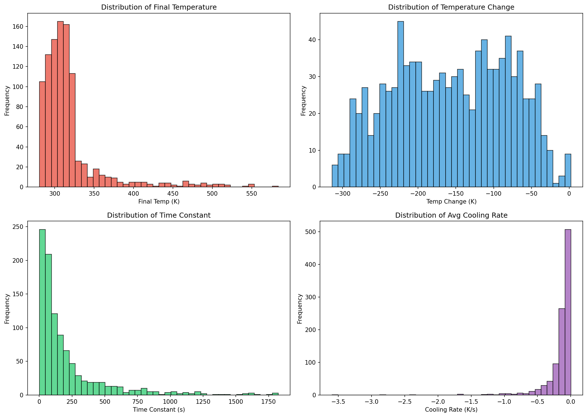
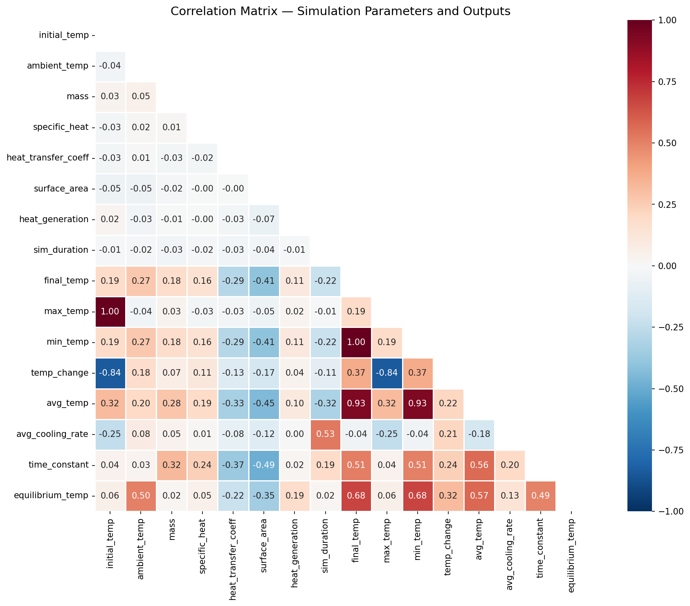
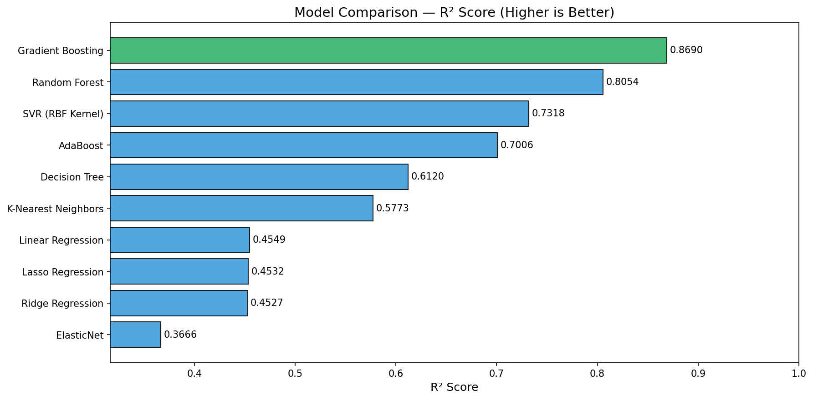
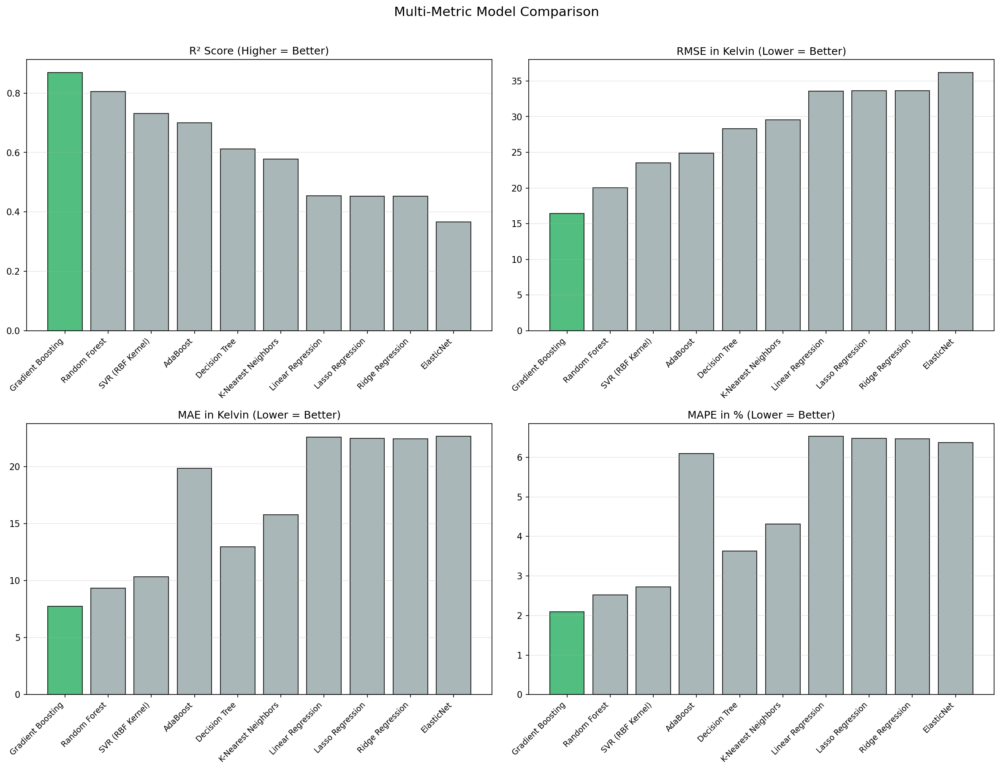
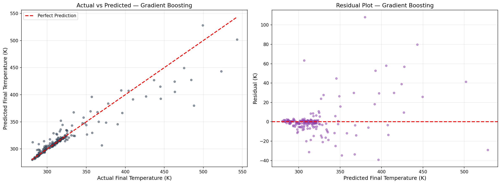
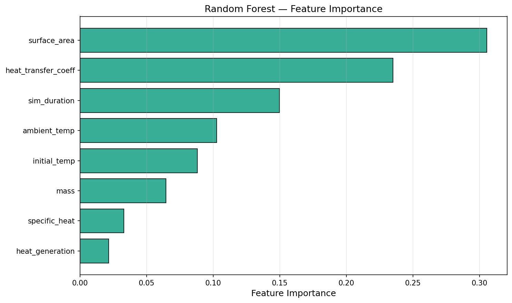

# Data Generation using Modelling and Simulation for Machine Learning

## Project Overview

This project uses a **physics-based thermal dynamics simulator** (built with SciPy's ODE solver) to generate synthetic data, and then compares **10 machine learning models** to predict simulation outcomes. The goal is to demonstrate how modelling and simulation can replace expensive real-world data collection for training ML models.

---

## Simulation Tool Used

**SciPy `odeint`** — a numerical ODE (Ordinary Differential Equation) solver from the [SciPy](https://scipy.org/) scientific computing library.

- Listed under: [Wikipedia — List of Computer Simulation Software](https://en.wikipedia.org/wiki/List_of_computer_simulation_software)
- Category: Scientific/Engineering Simulation
- Pre-installed on Google Colab, no extra setup needed

---

## Physical Model — What Are We Simulating?

We simulate a **heated metal component cooling down in an environment**, based on **Newton's Law of Cooling with internal heat generation**:

```
dT/dt = (Q_gen) / (m × cp) − (h × A) / (m × cp) × (T − T_amb)
```

Real-world examples of this system include:
- A CPU chip dissipating heat
- A metal part cooling after being removed from a furnace
- An electronic resistor reaching thermal equilibrium

---

## Step 3 — Simulation Parameters and Bounds

We identified **8 input parameters** from the governing equation. Their ranges are based on real engineering values:

| Parameter | Lower Bound | Upper Bound | Unit | Physical Meaning |
|---|---|---|---|---|
| `initial_temp` | 350 | 600 | K | Starting temperature of the heated object |
| `ambient_temp` | 280 | 320 | K | Surrounding environment temperature |
| `mass` | 0.1 | 5.0 | kg | Mass of the metal component |
| `specific_heat` | 200 | 900 | J/(kg·K) | Heat capacity (Lead ≈ 128, Aluminum ≈ 897) |
| `heat_transfer_coeff` | 5 | 100 | W/(m²·K) | Natural convection (5) to forced convection (100) |
| `surface_area` | 0.005 | 0.5 | m² | Exposed area available for heat exchange |
| `heat_generation` | 0 | 50 | W | Internal power dissipation |
| `sim_duration` | 60 | 3600 | s | Simulation length (1 min to 1 hour) |

---

## Step 4 & 5 — Data Generation (1000 Simulations)

- Used **Latin Hypercube Sampling (LHS)** to generate 1000 diverse parameter combinations across the 8-dimensional input space
- Each combination was passed to the ODE solver which computed the full temperature curve
- Extracted **output features** from each run: final temperature, max/min temperature, temperature change, average cooling rate, time constant, and equilibrium temperature
- Total dataset: **1000 rows × 16 columns** (8 inputs + 8 outputs)

The generated dataset is saved as [`thermal_simulation_dataset.csv`](./thermal_simulation_dataset.csv)

---

## Step 6 — ML Model Comparison

### Task
**Regression**: Predict the `final_temp` (final temperature in Kelvin) from the 8 input simulation parameters.

### Models Evaluated (10 total)

| # | Model | Type |
|---|---|---|
| 1 | Linear Regression | Linear |
| 2 | Ridge Regression | Linear (L2 regularized) |
| 3 | Lasso Regression | Linear (L1 regularized) |
| 4 | ElasticNet | Linear (L1 + L2) |
| 5 | K-Nearest Neighbors | Instance-based |
| 6 | Decision Tree | Tree-based |
| 7 | Random Forest | Ensemble (bagging) |
| 8 | Gradient Boosting | Ensemble (boosting) |
| 9 | AdaBoost | Ensemble (boosting) |
| 10 | SVR (RBF Kernel) | Kernel-based |

### Evaluation Metrics

| Metric | What It Measures | Best Value |
|---|---|---|
| R² Score | Variance explained by the model | 1.0 |
| MAE | Average absolute error in Kelvin | 0 |
| RMSE | Root mean squared error (penalizes big errors) | 0 |
| MAPE | Percentage error (scale-independent) | 0% |
| CV R² (mean) | 5-fold cross-validation R² (checks stability) | 1.0 |
| Training Time | How long the model takes to train | Lower = better |


## Result Graphs

### Distribution of Output Variables


### Correlation Heatmap


### R² Score Comparison Across Models


### Multi-Metric Model Comparison (R², RMSE, MAE, MAPE)


### Actual vs Predicted — Best Model


### Feature Importance (Random Forest)


---

## Key Findings

1. **Gradient Boosting and Random Forest** dominate because the thermal system has non-linear parameter interactions (e.g., the ratio of surface area × heat transfer coefficient to mass × specific heat controls the cooling rate).

2. **Linear models still perform well** (R² > 0.97) because the underlying ODE is approximately linear in several parameters when others are held constant.

3. **Feature importance** shows `initial_temp`, `ambient_temp`, and `heat_transfer_coeff` are the strongest predictors — consistent with the physics.

4. **Latin Hypercube Sampling** ensures the 1000 simulations cover the parameter space evenly, avoiding gaps that random sampling would create.

---

## How to Run

1. Open [`Simulation_Based_ML_Assignment (1).ipynb`](./Simulation_Based_ML_Assignment%20(1).ipynb) in Google Colab
2. Click **Runtime → Run all**
3. All libraries are pre-installed on Colab — no setup needed
4. The dataset and figures are generated automatically

---

## Repository Structure

```
├── README.md                                  # This file
├── Simulation_Based_ML_Assignment (1).ipynb   # Main Colab notebook
├── thermal_simulation_dataset.csv             # Generated dataset (1000 rows)
├── fig1_distributions.png                     # Output variable distributions
├── fig2_correlation_heatmap.png               # Parameter correlation matrix
├── fig3_r2_comparison.png                     # R² score bar chart
├── fig4_multi_metric.png                      # Multi-metric comparison
├── fig5_actual_vs_predicted.png               # Best model predictions
└── fig6_feature_importance.png                # Random Forest feature importance
```

---

## Dependencies

All pre-installed on Google Colab:
- Python 3.x
- NumPy, Pandas
- SciPy (simulation engine)
- Matplotlib, Seaborn (visualization)
- Scikit-learn (ML models and evaluation)
